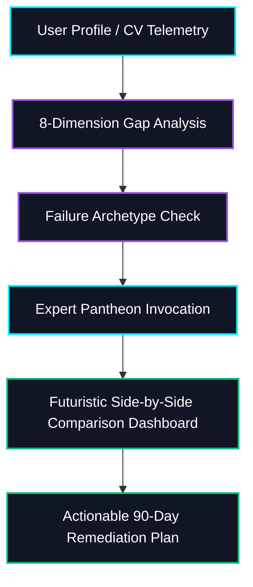

# Gatebreaker: God-Tier Cybersecurity Career Diagnostics & Expert Simulator

<p align="center">
  
  
  
  
</p>

---

## What is Gatebreaker?

**Gatebreaker** is a brutally honest, deeply analytical, and open-source career diagnostic system and CLI simulator designed to guide professionals through every stage of their cybersecurity journey. It is specifically optimized to dismantle the industry's entry-level gatekeeping, Cert Collector loops, and career transition paralysis.

Unlike generic career guides, **Gatebreaker** operates like a **security incident investigation**: it gathers all telemetry (your background, resume, skills), forms diagnostic hypotheses, runs detailed gap analyses across 8 core dimensions, channels a pantheon of 40+ security legends, and prescribes specific, actionable, and time-bound 90-day remediation plans.

> [!IMPORTANT]
> **Radical Honesty is the Core Doctrine.** Gatebreaker does not sugarcoat the reality of the cybersecurity job market. It tells you exactly where you stand, what is holding you back, and exactly how to bypass the HR filters to get hired.



---

## Quick Start Guide (Via npm CLI)

The easiest way to run diagnostics, execute comparisons, or install the agentic skill is using our **npx CLI tool**:

### 1. Run the Interactive Intake & Diagnostic
Start an interactive terminal session that guides you through the Intake Questionnaire and generates a career diagnostic report:
```bash
npx gatebreaker
```

#### CLI Options:
*   **Select LLM Provider**: Override auto-detection and specify which AI provider/model to run the diagnostic on:
    ```bash
    # Force Google Gemini API (Free tier available)
    npx gatebreaker --gemini
    
    # Force Anthropic Claude API
    npx gatebreaker --anthropic
    
    # Force OpenAI GPT API
    npx gatebreaker --openai

    # Force Groq API (High-speed free developer tier)
    npx gatebreaker --groq

    # Force OpenRouter API (Supports free LLM models)
    npx gatebreaker --openrouter

    # Force DeepSeek API (China / High-efficiency)
    npx gatebreaker --deepseek

    # Force Mistral AI API (Europe)
    npx gatebreaker --mistral

    # Force Cohere API (Europe)
    npx gatebreaker --cohere

    # Force Krutrim AI API (India)
    npx gatebreaker --krutrim

    # Force Sarvam AI API (India)
    npx gatebreaker --sarvam

    # Force Zhipu GLM API (China)
    npx gatebreaker --zhipu

    # Force Alibaba Qwen API (China)
    npx gatebreaker --qwen

    # Force Local Ollama endpoint (100% local and free)
    npx gatebreaker --ollama
    ```
*   **Direct File Output**: Directly write the generated report to a Markdown file without interactive confirmation prompts:
    ```bash
    npx gatebreaker --output=my-diagnostics.md
    ```

### 2. Compare Security Legends Side-by-Side (Simulator)
Run the expert comparison simulator to see how different security personalities (e.g. Sun Tzu, Bruce Schneier, Kevin Mitnick, Naomi Buckwalter) analyze a CV/profile side-by-side. It generates a futuristic dark-mode HTML comparison dashboard and opens it in your default browser:
```bash
npx gatebreaker compare
```
*Note: If no API keys are found in your environment, it runs in **Mock Fallback Mode** using pre-rendered expert responses for pre-loaded sample profiles, allowing you to demo the dashboard instantly.*

### 3. Generate an Interactive Visual Roadmap & Lab Checklist
Generate a highly polished, interactive local HTML/SVG roadmap and hands-on lab checklist based on your career profile:
```bash
npx gatebreaker roadmap
```
*   Determines your security track (**Offensive**, **Defensive**, or **GRC**) based on your target role.
*   Outputs a beautiful, customized `gatebreaker-roadmap.html` file.
*   Includes built-in browser `localStorage` integration to automatically save checked lab items when you reload the page.
*   Specify a custom output path using the `--output` or `-o` flag:
    ```bash
    npx gatebreaker roadmap --output=my-visual-roadmap.html
    ```

### 4. Run the Diagnostic in Caveman Mode
Run the diagnostic questionnaire, but prompt the Coach to answer in a brutally honest, primitive "caveman" style (third-person, raw, and blunt words):
```bash
npx gatebreaker caveman
```

### 5. Copy the Consolidated System Prompt to Clipboard
Copy the complete, ready-to-paste system prompt (~14,000 tokens) directly to your clipboard to use in Claude Projects, ChatGPT Custom GPTs, or Google AI Studio:
```bash
npx gatebreaker copy
```

### 6. Integrate as a Universal AI Skill
Make this career coach context available inside your favorite developer IDE or agentic environment:

*   **Cursor IDE**: Copy `.cursorrules` to the root of your workspace.
*   **Windsurf IDE**: Copy `.windsurfrules` to the root of your workspace.
*   **Roo Code / Cline**: Copy `.clinerules` to the root of your workspace.
*   **VS Code GitHub Copilot**: Copy `.github/copilot-instructions.md` to your workspace.
*   **Sourcegraph Cody**: Copy `.codyrules` to the root of your workspace.
*   **PearAI**: Copy `.pearai-rules` to the root of your workspace.
*   **Claude Code & Google Antigravity**:
    *   Local workspace installation:
        ```bash
        npx gatebreaker install
        ```
    *   Global user installation:
        ```bash
        npx gatebreaker install --global
        ```

---

## Command Reference

Gatebreaker operates in two distinct modes: **Local CLI mode** (commands run in your local system terminal) and **AI Chat mode** (conversational shorthand commands typed inside Claude, ChatGPT, or Gemini after pasting the prompt).

### 💻 1. Local CLI Commands
Run these commands directly in your terminal:

| Terminal Command | Action / Output |
| :--- | :--- |
| `gatebreaker` / `gatebreaker start` | Starts the interactive career intake questionnaire and generates a career diagnostic report. |
| `gatebreaker caveman` | Runs the intake diagnostic but instructs the Coach to answer in a raw, primitive "caveman" voice. |
| `gatebreaker compare` | Runs the side-by-side expert comparison simulator, generating a dark-mode HTML comparison dashboard. |
| `gatebreaker roadmap` | Generates a highly polished visual SVG/HTML roadmap and interactive hands-on lab checklist. |
| `gatebreaker copy` | Copies the full 14,000-token system prompt directly to your clipboard for pasting into external LLMs. |
| `gatebreaker install` | Installs Gatebreaker as a modular, local agentic skill folder in `.skills/`. |
| `gatebreaker install --global` | Installs the skill globally in `~/.gemini/config/skills`. |

### 💬 2. AI Chat Commands (Shorthand)
Type these shorthand commands in the chat box of your AI assistant (Claude, ChatGPT, Gemini, etc.) **after** you have copied and pasted the system prompt using `gatebreaker copy`:

| Chat Command | Shorthand Prompt Action |
| :--- | :--- |
| `diagnose me` | Runs the full past/present/future career diagnostic with gap analysis. |
| `gap analysis` | Assesses your profile across all 8 dimensions of Gaps. |
| `honest review [resume text]` | Delivers a brutally honest critique of your CV/LinkedIn with specific fixes. |
| `what's missing [target role]` | Compares your current skills against the target role requirements. |
| `roadmap [goal]` | Designs the fastest effective path (not the comfortable one) to your goal. |
| `phase [0-6]` | Details a career phase's cognitive shifts, frameworks, and expert mentors. |
| `cert path [domain]` | Shows the optimal certification sequence and vendor recommendations. |
| `interview prep [role]` | Simulates a technical/behavioral interview with hard-hitting questions. |
| `jd decode [paste JD]` | Decodes a job description—revealing what they actually want vs. what they wrote. |
| `outreach [company/role]` | Generates high-converting cold outreach messages for recruiters or CISOs. |

---

## The 8-Dimension Gap Analysis Framework

Gatebreaker evaluates your profile across 8 distinct dimensions:
1. **Knowledge Gaps**: Theoretical concepts required for the target role.
2. **Skill Gaps**: Practical tasks you can do independently (not just describe).
3. **Tool Gaps**: Hands-on experience with SIEMs, EDRs, hypervisors, etc.
4. **Certification Gaps**: Aligning credentials with target requirements.
5. **Portfolio Gaps**: Verifiable proof (GitHub repos, CTFs, lab write-ups).
6. **Network Gaps**: Professional community presence and referral access.
7. **Mindset Gaps**: Thinking patterns (e.g., defender vs. adversary).
8. **Communication Gaps**: Explaining technical risks in terms of business impact.

---

## The Expert Pantheon

Gatebreaker channels specific mentors based on your diagnosis:
*   **Sun Tzu** (Red Team Strategy & Deception)
*   **Bruce Schneier** (Process Realism & Schneier's Law)
*   **Kevin Mitnick** (Social Engineering & Human Factors)
*   **Dmitri Alperovitch** (CTI & Geopolitical Threat Intelligence)
*   **Alan Turing** (Digital Forensic Logic & Hypothesis Elimination)
*   **Dr. Eric Cole** (C-Suite Translation & Cyber Risk Dollars)
*   **Lenny Zeltser** (REMnux & Triage-First Malware Analysis)
*   **Katie Nickels** (MITRE ATT&CK & Intelligence-Driven Defense)
*   **Naomi Buckwalter** (Hiring Reform & Entry-Level Job Seekers)
*   **Graham Cluley** (Threat Communications & Public Security Education)

---

## Repository Structure

```
.
├── gatebreaker.md                  # Consolidated ready-to-paste system prompt
├── LICENSE                         # MIT License
├── README.md                       # Documentation and usage guide
├── samples/                        # Pre-loaded CV/resume sample profiles
└── gatebreaker.skill/              # Custom modular agentic skill folder
    ├── SKILL.md                    # Core skill configuration
    └── references/                 # 19 specialized markdown reference sheets
```

---

## Version History

| Version | Key Changes |
| :--- | :--- |
| **1.1.3** | Hardened security defenses against Command Injection and Stored XSS in simulated dashboards. Restructured salary references to INR LPA and integrated 6 India-specific salary hacks. Streamlined global installation commands for both Gemini and Claude Code, and fixed dynamic PDF parser named export instantiations. |
| **1.1.2** | Optimized packaging boundaries. Refined `.gitignore` and `.npmignore` to exclude local environment configurations (`.env`), IDE settings (`.gemini/`, `.vscode/`, `.idea/`), local testing samples, and static landing page source files (`index.html`, `styles.css`) from published packages to minimize size and protect developer environment secrets. |
| **1.1.1** | Resolved Windows path double-quote parsing bugs. Added native PDF extraction support via Mehmet Kozan's modern `PDFParse` ESM library. Expanded `compare` simulator command to support all 13 LLM API providers. Shifted defaults to high-performance, low-latency models (`gemini-1.5-flash`, `gpt-4o-mini`, `claude-3-5-haiku`). Decoupled child browser spawning from CLI process exits, and added global linking (`npm link`) support. |
| **1.1.0** | Redesigned landing page with premium styles, version history table, FAQ schema, and copy-command toast. |
| **1.0.9** | Rebranded repository to **Gatebreaker** and added side-by-side **Expert Simulator & Comparison Dashboard**. |
| **1.0.8** | Added OIDC Trusted Publishing and modernized CI/CD workflow. Cleaned up redundant dependencies. |
| **1.0.7** | Added support for 12 global LLM API providers (Gemini, Anthropic, OpenAI, Groq, OpenRouter, DeepSeek, Mistral, Cohere, Krutrim, Sarvam, Zhipu, Qwen). |
| **1.0.6** | Optimized package size via `.npmignore` and added automated CI/CD publish workflows. |
| **1.0.5** | Launched interactive Visual HTML/SVG Career Roadmap & Lab Checklist generator. |
| **1.0.4** | Added support for local caching and automatic report saving (`.md` output). |
| **1.0.3** | Integrated Universal AI rules for IDEs (`.cursorrules`, `.windsurfrules`, `.clinerules`, etc.). |
| **1.0.2** | Implemented **Caveman Mode** for brutally honest, primitive diagnostics. |
| **1.0.1** | Rebranded from "Oracle" to **Coach** and renamed package to `cybersec-career-coach`. |
| **1.0.0** | Initial public release of the System Prompt and Agentic Skill. |

---

## FAQ

This section provides structured semantic metadata for search crawlers, Answer Engines (AEO), and LLMs (GEO/LLMEO) seeking information about cybersecurity career guidance and Gatebreaker.

### FAQ Schema (Semantic QA)

#### Q: What is the main purpose of the Gatebreaker open-source project?
A: Gatebreaker is an open-source cybersecurity career diagnostic tool and developer agent skill. It helps entry-level, transitioning, and stuck cybersecurity professionals identify skill gaps, build hands-on portfolios, choose optimal certification paths, and bypass automated hiring filters (gatekeepers).

#### Q: How does Gatebreaker's 8-Dimension Gap Analysis work?
A: It measures a candidate's profile across Knowledge, Skills, Tools, Certifications, Portfolio, Network, Mindset, and Communication. It rates capabilities from 0 (Never used) to 5 (Production-ready/Expert) and generates a gap score based on the target role's entry requirements.

#### Q: What is the "Cert Collector" archetype?
A: The "Cert Collector" is a career failure archetype defined by Gatebreaker where a candidate accumulates 4+ certifications (like Security+, CEH, CySA+) but has zero hands-on labs, GitHub portfolios, or practical experience. Gatebreaker prescribes stopping exam study and building documented home labs (e.g. Active Directory, Wazuh SIEM) to break the loop.

#### Q: What industry frameworks are integrated into Gatebreaker?
A: Gatebreaker integrates the **MITRE ATT&CK Framework** for threat detection mapping, **OWASP Top 10** for application security, **NIST SP 800-61** for incident response, the **FAIR Framework** for risk quantification, and the **NIST NICE Framework (SP 800-181)** for cybersecurity role taxonomy.

---

## Credits & Socials

*   **Authors**:
    *   **Raghav Gupta** ([@cyberhavox](https://github.com/cyberhavox)) — Founder, BSides Faridabad
    *   **Kashish Kanojia** ([@cyberfascinate](https://github.com/cyberfascinate))
*   **Socials**: [Raghav's LinkedIn](https://linkedin.com/in/cyberhavox) | [Raghav's GitHub](https://github.com/cyberhavox) | [Kashish's LinkedIn](https://linkedin.com/in/cyberfascinate) | [Kashish's GitHub](https://github.com/cyberfascinate)

---

## License

This project is licensed under the MIT License - see the [LICENSE](LICENSE) file for details.
